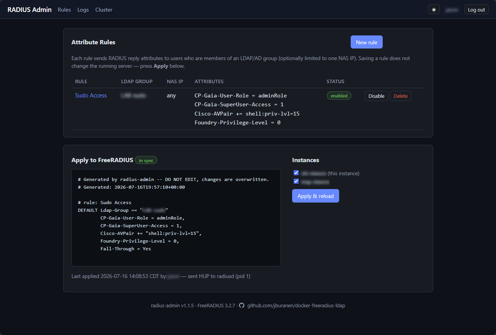
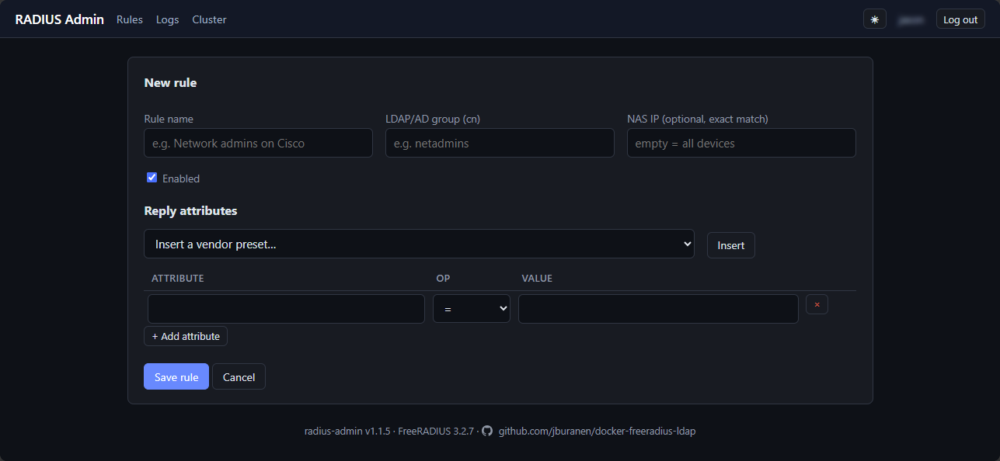
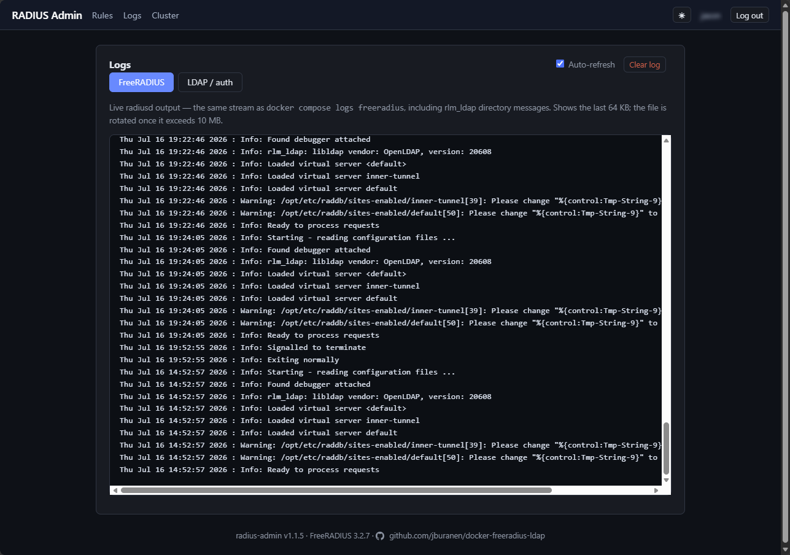
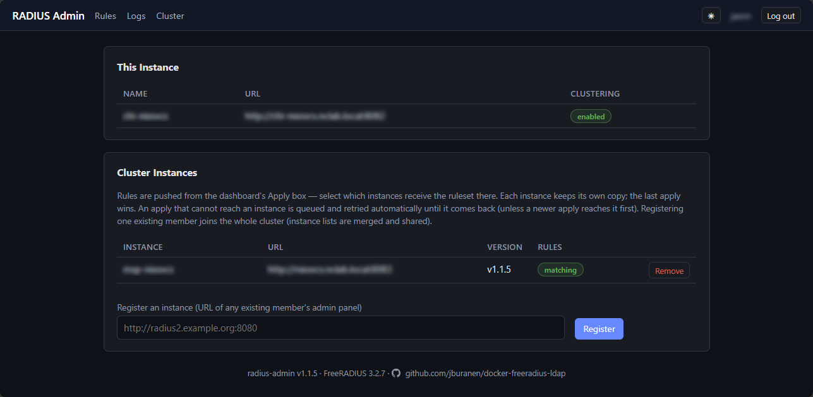

# docker-freeradius-ldap

A Docker-deployed [FreeRADIUS](https://freeradius.org/) server backed by an
LDAP or Active Directory user database, with a web admin panel for managing
custom RADIUS reply attributes (Cisco IOS, Check Point Gaia, Brocade ICX
presets included). `docker compose up -d` is the entire deployment — the
FreeRADIUS service runs the unmodified official image configured through
`.env`, and Compose builds the small admin panel image automatically on
first run.

## Quick start

```sh
cp .env.example .env        # point it at your AD/LDAP and set secrets
docker compose up -d
```

Test authentication with a directory account (the first run seeds a default
client with the shared secret `testing123`):

```sh
docker compose exec freeradius radtest <username> <password> localhost 0 testing123
```

Expect `Access-Accept`. From another machine, point `radtest`/your NAS at UDP
1812 with that shared secret. Manage clients and their secrets in the panel's
**Clients** tab (see below) — change the default before exposing the server.

Then open the admin panel at `http://<host>:8080` (port from `ADMIN_PORT`)
and log in with directory credentials — access requires membership in the
group named by `ADMIN_GROUP`.

## Admin panel

The `radius-admin` service manages **attribute rules**: each rule maps an
LDAP/AD group (optionally restricted to a single NAS IP) to a list of RADIUS
reply attributes. Typical use: members of `netadmins` get
`Cisco-AVPair = "shell:priv-lvl=15"` on Cisco switches, `CP-Gaia-User-Role =
adminRole` on Check Point Gaia, `Foundry-Privilege-Level = 0` on Brocade ICX —
all available as one-click presets, plus free-form attributes from any
dictionary FreeRADIUS loads.

- **Login** uses the same `LDAP_*` settings as RADIUS auth (bind-as-user).
  Access requires membership in the group named by `ADMIN_GROUP`.
- **Apply & reload** renders the rules into a FreeRADIUS `users` file on a
  shared volume and sends radiusd a SIGHUP. The reload is transactional: if
  the new file fails to parse, FreeRADIUS keeps the previous rules.
- Saving a rule never touches the running server until you press Apply; the
  dashboard shows a "pending changes" badge and a live preview of the
  generated file.
- **Clients** (tab) manages the RADIUS clients (NAS devices) that may talk to
  the server, organized as **profiles**: a shared parameter set — shared
  secret, protocol, NAS type, per-client BlastRADIUS options
  (Message-Authenticator / Proxy-State), and any extra `clients.conf`
  directives — applied to **one or more CIDRs**, each of which becomes its own
  FreeRADIUS client block. A default profile (CIDR `0.0.0.0/0`, secret
  `testing123`) is seeded on first run. Because FreeRADIUS loads clients only
  at startup, **Apply** on this tab restarts radiusd (a ~1–2 s interruption)
  rather than hot-reloading; if the new configuration fails to load, the
  panel rolls back to the previous clients automatically so a typo can't take
  authentication down.





- **Logs** shows two live, auto-refreshing tails: the raw radiusd output
  (the same stream as `docker compose logs freeradius`, including rlm_ldap
  directory messages), and an **LDAP / auth** log with one line per RADIUS
  authentication result — Access-Accept/Reject with the failure detail,
  which in this stack means the LDAP bind outcome — interleaved with the
  panel's own logins, binds, and rule applies. Both files live on a shared
  volume, each capped at `RADIUS_LOG_MAX_MB` (default 10 MB, one previous
  generation kept).



- The panel speaks plain HTTP; put a TLS reverse proxy in front of it for
  production.

## Clustering (redundant deployments)

Deploy the stack on two or more hosts and join them into a cluster: log in
to **any** instance's panel and apply the **attribute rules and the RADIUS
clients** to all of them — or multi-select which instances receive them — in
one click.

1. In each instance's `.env`, set the **same** `CLUSTER_SECRET`, a friendly
   `CLUSTER_NODE_NAME`, and `CLUSTER_NODE_URL` (that panel's address as the
   other instances reach it), then `docker compose up -d --build radius-admin`.
2. On the new instance's **Cluster** page, register the URL of any existing
   member (or vice versa). Registration is mutual and the member list is
   shared, so one action joins the full mesh.
3. Both the Rules dashboard and the Clients tab then show their Apply box with
   a checkbox per instance (all selected by default). Applying clients
   restarts radiusd on each selected instance.



Notes: instance-to-instance calls are HMAC-signed with `CLUSTER_SECRET`
(the secret is never transmitted; clocks must agree within 5 minutes). Rules
and clients are each pushed as a full replacement — the last apply wins. Each
instance still authenticates panel logins against its own LDAP settings, and
the Cluster page shows reachability, version, and — separately for rules and
clients — whether each member matches the instance you're looking at.

If a targeted instance is **offline during an apply**, the apply is queued
on the instance you used and retried every 60 seconds until the member is
back — it catches up automatically. Rules and clients queue independently per
member. Every apply carries a timestamp, so a queued (older) delivery is
discarded if a newer apply already reached the member directly. Queued
deliveries are shown on the Cluster page, where they can also be cancelled.
The queue lives on the originating instance: if that instance is itself down,
delivery resumes when it returns.

## How it works

- **freeradius** runs the official `freeradius/freeradius-server` image.
  Project config files are bind-mounted over the stock ones; FreeRADIUS's
  native `$ENV{...}` expansion pulls every site-specific value (LDAP server,
  bind credentials, filters) from the container environment, which Compose
  loads from `.env`. Nothing is baked into an image. RADIUS clients (NAS
  devices and their shared secrets) are the exception — they are managed in
  the panel's Clients tab and written to a shared volume.
- **Users** are looked up in LDAP/AD; plaintext (PAP) requests authenticate by
  binding to the directory as the user — the standard approach for Active
  Directory, which never exposes password hashes.
- **Groups**: set `RADIUS_REQUIRED_GROUP` in `.env` to restrict access to
  members of one LDAP/AD group; leave it empty to allow any directory user.

## Configuration

Every setting is documented inline in [.env.example](.env.example), including
Active Directory example values for each section (server URI, bind DN, user
filter with `sAMAccountName`, `memberOf` group membership).

| Area | Variables |
|------|-----------|
| Ports | `RADIUS_AUTH_PORT`, `RADIUS_ACCT_PORT`, `ADMIN_PORT` |
| Server image | `FREERADIUS_IMAGE` (optional override) |
| RADIUS clients | Managed in the panel's **Clients** tab (not `.env`) |
| Access policy | `RADIUS_REQUIRED_GROUP` |
| Admin panel | `ADMIN_GROUP`, `ADMIN_SESSION_SECRET`, `RADIUS_LOG_MAX_MB` |
| Cluster | `CLUSTER_SECRET`, `CLUSTER_NODE_NAME`, `CLUSTER_NODE_URL` |
| Directory connection | `LDAP_SERVER`, `LDAP_START_TLS`, `LDAP_TLS_REQUIRE_CERT`, `LDAP_BIND_DN`, `LDAP_BIND_PASSWORD`, `LDAP_BASE_DN` |
| User lookup | `LDAP_USER_BASE_DN`, `LDAP_USER_OBJECT_FILTER`, `LDAP_USER_NAME_ATTRIBUTE` |
| Group lookup | `LDAP_GROUP_BASE_DN`, `LDAP_GROUP_OBJECT_FILTER`, `LDAP_GROUP_MEMBERSHIP_FILTER`, `LDAP_GROUP_MEMBERSHIP_ATTRIBUTE` |

After changing `.env`, apply with `docker compose up -d --force-recreate freeradius`.

### Upgrading

New versions can introduce new `.env` variables. After a `git pull`, merge
them into your existing `.env` without touching your customizations:

```sh
./merge-env.sh
```

It appends any variable that `.env.example` has and your `.env` lacks
(backing `.env` up to `.env.bak` first), prints exactly what it added, and
never modifies existing lines — run it as often as you like. Review the
added values (each is documented in `.env.example`; some are placeholders
like `CLUSTER_NODE_NAME`), then `docker compose up -d --build --force-recreate`.
Optional variables that ship commented out (e.g. `FREERADIUS_IMAGE`) are
not copied — enable those by hand.

## Authentication methods

| Method | Works against | Notes |
|--------|--------------|-------|
| PAP (incl. EAP-TTLS/PAP) | AD and any LDAP | Bind-as-user; recommended for AD |
| CHAP / MSCHAPv2 (incl. PEAP) | Directories that expose a readable password | **Not** plain AD — AD needs Samba/winbind + `ntlm_auth` (not included yet) |

## Troubleshooting

```sh
docker compose logs -f freeradius     # server log (stdout)
docker compose stop freeradius
docker compose run --rm freeradius radiusd -X   # full debug mode, foreground
```

## Repository layout

```
docker-compose.yml            # the whole stack
.env.example                  # all settings, documented (copy to .env)
merge-env.sh                  # after git pull: append new vars to your .env
freeradius/raddb/             # config mounted over the image defaults
  clients.conf                #   NAS clients ($ENV-driven)
  mods-enabled/ldap           #   LDAP module ($ENV-driven)
  sites-available/default     #   outer virtual server
  sites-available/inner-tunnel#   EAP inner tunnel
web/                          # radius-admin panel (Flask; compose builds it)
CLAUDE.md                     # project context for AI-assisted development
```

## Security

- `.env` holds all secrets and is git-ignored; only `.env.example` (safe
  placeholders) is committed. Client shared secrets live in the
  `admin-data`/`radius-clients` volumes, not `.env`.
- In the Clients tab, restrict each profile's CIDRs to your NAS subnets and
  replace the seeded default profile (`0.0.0.0/0`, secret `testing123`) before
  exposing the server.
- Use `ldaps://` or `LDAP_START_TLS=yes` plus a least-privilege bind account
  against production directories.

## Roadmap

- Manage the group gate from the admin panel (NAS clients are now managed in
  the Clients tab)
- Add read-only user group and necessary RBAC
- Package into simpler form not requiring --build for deployment/refresh

## License

TBD
